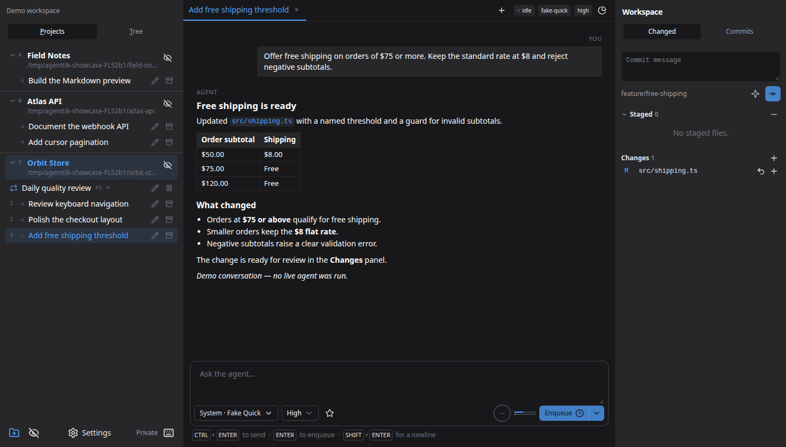
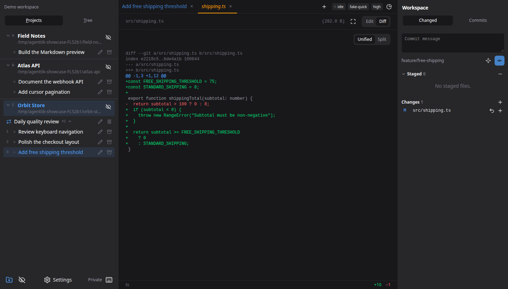
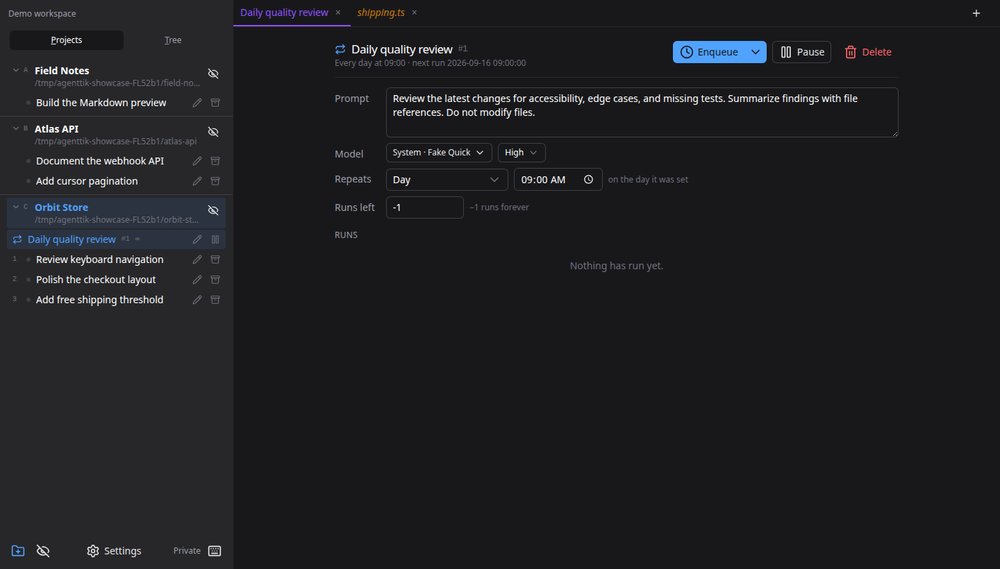

# agenttik

A local workspace for running AI coding sessions across multiple projects.
Use Claude Code, Codex and GitHub Copilot through their official CLIs, with your existing login,
in one desktop window or browser tab. Desktop builds support Linux, macOS ARM64,
and Windows x64.



## Main features

- **Project workspaces:** organize sessions and file tabs; archive and restore conversations.
- **Orchestrator:** enable a separate pinned project in Settings to inspect work and manage tasks across projects, with editable instructions and a reset to the built-in prompt.
- **Live sessions:** stream replies, resume conversations, and queue prompts per project.
- **Reusable work:** pin prompts and schedule recurring tasks.
- **Model controls:** choose models, effort, permissions, and favorite combinations.
- **Code tools:** browse and edit files, preview Markdown/HTML, inspect Git diffs, stage changes, and write commits.
- **Usage tracking:** view tokens, context usage, subscription allowance, and costs where reported.
- **Local state:** SQLite history, remembered tabs, customizable shortcuts, and color themes. Use profiles for separate workspaces or private mode for a temporary one.

Claude Code is working; Codex, GitHub Copilot and OpenCode Go are implemented, with live-turn validation still pending. OpenCode Go supports direct use with a subscription key and an optional CLI; Settings defaults to the CLI when installed.

## Screenshots

Captured from a fresh private instance and browser context with fictional projects
and demo conversation data. No live agent was run. Click an image to view it full size.

### Review code where you work

Open a changed file beside your project tasks. Compare the diff, stage individual
files, and prepare a commit from the workspace panel.



### Schedule recurring work

Give a recurring task its own prompt, model, and schedule. Review its next run and
history, or pause it from the same view.



## Quick start

Use Go 1.25+, Node.js 22.12+ with npm, and either a logged-in `claude`, `codex` or `copilot` CLI on `PATH`, or an OpenCode Go key configured in Settings → Subscriptions. The `opencode` CLI is optional.

```sh
make run-web
```

Open [localhost:7717](http://127.0.0.1:7717), add a project folder, and start a session.
Or add one from the terminal with `agenttik --init` in the folder you want —
`agenttik --init path/to/repo` names another — which works whether or not the
app is already open, and shows up in an open window straight away.

### Remote servers and private workspaces

Connect to another server with `agenttik --remote host:7717` (or an HTTPS
URL), or choose **Connect to remote server** in the command palette. The
client checks `/api/version` first, then shows the server’s login if needed.
See [remote connections](specs/064-remote-connections.md).

Start a temporary, separate instance with `agenttik --private`. Its app data is
removed on exit; project files stay on disk. Manage local profiles in
**Settings → Profiles**. With multiple profiles, the picker before Shortcuts
switches between their isolated projects and tasks.

`--addr` and `--data-dir` change where it listens and where it keeps its
database, `--web` skips the desktop window, and `--help` and `--version` say
what this build is.

### Desktop builds

For the desktop app, install the native build dependencies (`make deps` on
Debian/Ubuntu), then run `make run`. `make build-windows-amd64` cross-compiles
the Windows x64 binary; build the macOS ARM64 target on macOS with
`make build-macos-arm64`. macOS builds also create an ad-hoc-signed
`agenttik.app` and a ZIP (`bin/` for `make build`, `dist/` for the ARM64 target).
Extract the release ZIP and move the app to Applications. No Apple developer
account is needed to build it. Downloaded builds are not notarized; after a
blocked launch, use System Settings → Privacy & Security → Open Anyway.

On macOS, Close to tray works even without Accessibility permission. The global
show/hide shortcut needs that permission; grant it in System Settings → Privacy
& Security → Accessibility, then restart agenttik. Shortcut failures appear in
agenttik's desktop settings while the tray menu remains usable.

**Local access by default:** agenttik binds to loopback. Anyone who can reach an
unauthenticated server has full control of it. Before exposing it through
**Settings → Server**, configure authentication and use a trusted network. See
[server access](specs/043-exposed-server.md).

Built with Go, SQLite, Vue 3, Nuxt UI, and Wails. See [specs](specs/index.md)
for architecture and implementation details.

## License

[MIT](LICENSE).
